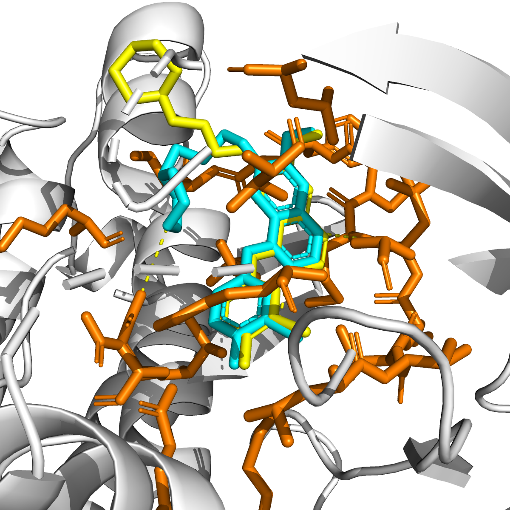
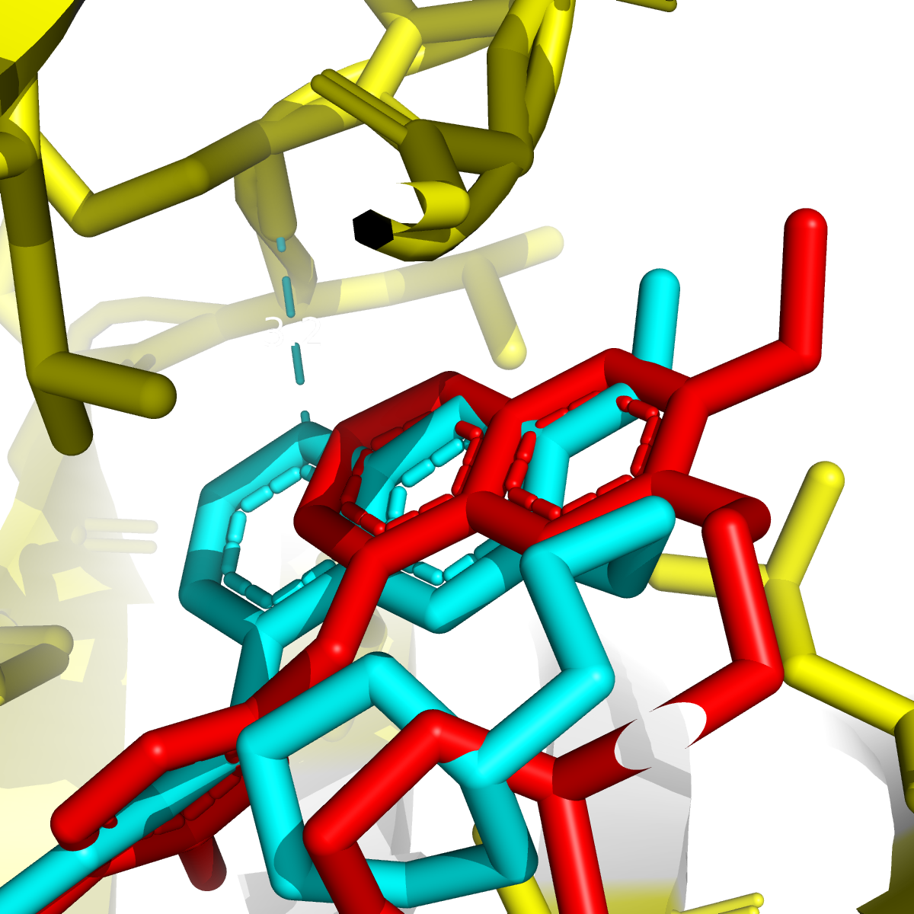

# EGFR Inhibitor Binding Analysis & T790M Resistance Mutation Study

> "Structural Biology-Based Drug Discovery Project"  
> Structural analysis of Gefitinib binding to EGFR and the impact of T790M resistance mutation on binding affinity

---

## Project Overview

EGFR (Epidermal Growth Factor Receptor) is a well-established oncology target that is overactivated in many cancer cells.  
This project structurally analyzes the binding mechanism of "Gefitinib", a first-generation EGFR inhibitor,  
and investigates how the "T790M resistance mutation" affects binding affinity through molecular docking.

---

## Key Results

| Condition | Binding Energy (ΔG) | Interpretation |
|-----------|-------------------|----------------|
| Wild-type EGFR + Gefitinib | "-8.755 kcal/mol" | Strong binding  |
| T790M mutant EGFR + Gefitinib | "-7.320 kcal/mol" | Reduced binding ️ |
| "Difference" | "1.435 kcal/mol" | Structural basis of resistance |

> The T790M mutation reduces Gefitinib binding affinity by approximately "16%", consistent with clinically observed drug resistance.

---

## ️ Tools & Environment

| Tool | Version | Purpose |
|------|---------|---------|
| PyMOL (Open-Source) | 3.1.0 | Protein structure visualization, mutagenesis |
| AutoDock Vina | 1.2.7 | Molecular docking |
| MGLTools | 1.5.7 | .pdb → .pdbqt conversion |
| Python | 3.13.1 | Coordinate calculation |
| Anaconda | 26.1.1 | Environment management |

---

## Project Structure

```
EGFR_project/
├── receptor/
│   ├── 4WKQ_protein.pdb       # Wild-type EGFR protein structure
│   ├── 4WKQ_protein.pdbqt     # Converted file for docking
│   ├── 4WKQ_T790M.pdb         # T790M mutant protein structure
│   └── 4WKQ_T790M.pdbqt       # Converted file for docking
├── ligand/
│   ├── gefitinib.pdb          # Gefitinib structure
│   └── gefitinib.pdbqt        # Converted file for docking
└── docking/
    ├── config.txt                    # Wild-type docking config
    ├── config_T790M.txt              # T790M docking config
    ├── gefitinib_docked.pdbqt        # Wild-type docking results
    ├── gefitinib_T790M_docked.pdbqt  # T790M docking results
    ├── EGFR_docking_result.png       # Docking result visualization
    └── EGFR_T790M_comparison.png     # Mutation comparison visualization
```

---

## Analysis Workflow

```
[Step 1] Target Structure Analysis
Download EGFR + Gefitinib complex from PDB (4WKQ)
Visualize active site and analyze hydrogen bonds using PyMOL
        ↓
[Step 2] Docking Preparation
Convert protein/ligand .pdb → .pdbqt using MGLTools
Calculate active site center coordinates (Search Box setup)
        ↓
[Step 3] Molecular Docking
Perform Gefitinib docking using AutoDock Vina
Calculate binding energy (ΔG) and analyze binding poses
        ↓
[Step 4] Resistance Mutation Analysis
Introduce T790M mutation using PyMOL Mutagenesis Wizard
Re-dock under identical conditions with mutant protein
Compare binding energies: wild-type vs T790M mutant
```

---

## Key Findings

### 1. Gefitinib - EGFR Hydrogen Bond Analysis
- Hydrogen bond formation confirmed with key active site residues (Met769, Thr766)
- Bond distances: 2.8 ~ 3.2 Å (within normal hydrogen bond range)

### 2. Docking Validation
- Comparison of predicted pose vs. crystallographic position
- Core scaffold (quinazoline ring) position confirmed to match

### 3. T790M Resistance Mechanism
- Residue 790: Threonine (small) → Methionine (bulky)
- Increased gatekeeper residue size reduces Gefitinib binding space
- 1.435 kcal/mol decrease in binding energy → structural basis of resistance

---

## ️ Visualization

### Docking Result


```
White  → EGFR protein backbone
Cyan   → Vina predicted docking pose
Yellow → Crystallographic Gefitinib position
Orange → Active site residues
```

### T790M Mutation Comparison


```
Cyan   → Wild-type EGFR docking pose
Red    → T790M mutant docking pose
Green  → Wild-type T790 residue (Threonine)
Orange → Mutant M790 residue (Methionine)
```

---

## Conclusion

1. "Gefitinib binds strongly to the EGFR active site", competitively inhibiting ATP binding through hydrogen bond interactions.
2. "The T790M mutation increases gatekeeper residue bulk", reducing the available binding space for Gefitinib.
3. These findings are "consistent with the structural rationale for 3rd-generation EGFR inhibitor (Osimertinib) development".

---

## References

- Yun, C.H. et al. (2008). The T790M mutation in EGFR kinase causes drug resistance. *PNAS*
- Trott, O. & Olson, A.J. (2010). AutoDock Vina. *J. Comp. Chem.*
- PDB ID: 4WKQ - EGFR kinase domain in complex with Gefitinib

---

## Author

"Janghyun Kim" | Aspiring Structural Biology & Drug Discovery Researcher  
GitHub: [@jhkwin00](https://github.com/jhkwin00)
