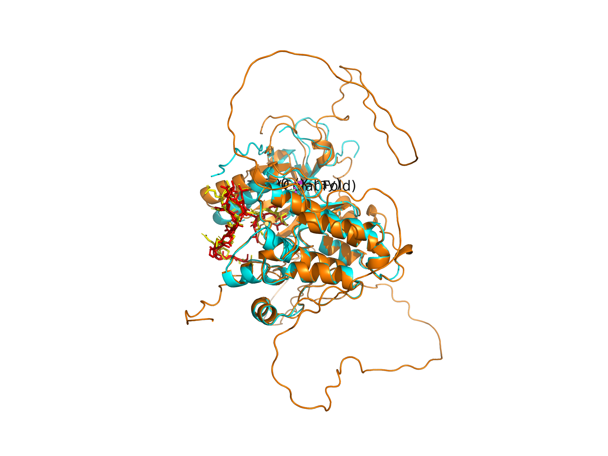
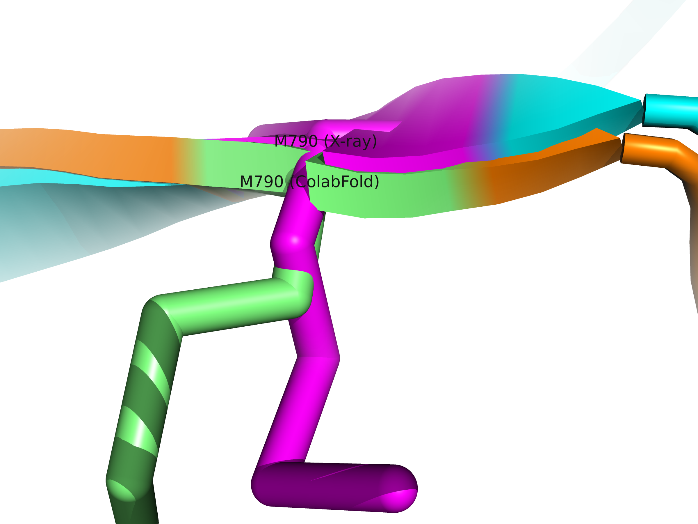
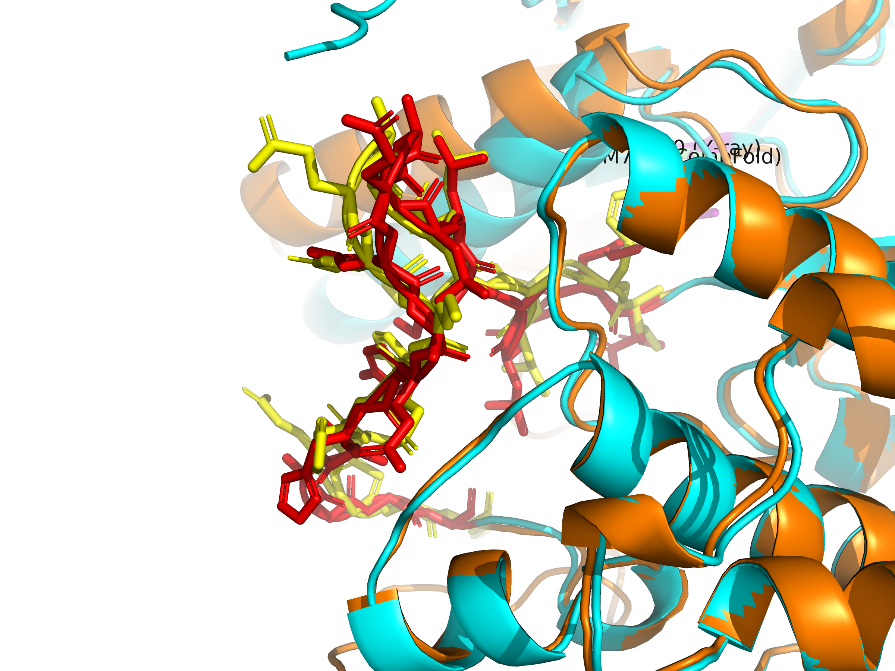

# EGFR Inhibitor Binding Analysis & T790M Resistance Mutation Study

> Structural Biology-Based Drug Discovery Project
> Structural analysis of Gefitinib binding to EGFR and the impact of T790M resistance mutation on binding affinity

---

## Project Overview

EGFR (Epidermal Growth Factor Receptor) is a well-established oncology target that is overactivated in many cancer cells.
This project structurally analyzes the binding mechanism of Gefitinib, a first-generation EGFR inhibitor,
and investigates how the T790M resistance mutation affects binding affinity through molecular docking.
Additionally, the T790M mutant structure was predicted using ColabFold and validated against the experimental X-ray structure.

---

## Project 1 — Molecular Docking Analysis

### Key Results

| Condition | Binding Energy (dG) | Interpretation |
|-----------|-------------------|----------------|
| Wild-type EGFR + Gefitinib | -8.755 kcal/mol | Strong binding |
| T790M mutant EGFR + Gefitinib | -7.320 kcal/mol | Reduced binding |
| Difference | 1.435 kcal/mol | Structural basis of resistance |

> The T790M mutation reduces Gefitinib binding affinity by approximately 16%, consistent with clinically observed drug resistance.

### Key Findings

1. Gefitinib - EGFR Hydrogen Bond Analysis
   - Hydrogen bond formation confirmed with key active site residues (Met769, Thr766)
   - Bond distances: 2.8 ~ 3.2 Angstrom (within normal hydrogen bond range)

2. Docking Validation
   - Comparison of predicted pose vs. crystallographic position
   - Core scaffold (quinazoline ring) position confirmed to match

3. T790M Resistance Mechanism
   - Residue 790: Threonine (small) -> Methionine (bulky)
   - Increased gatekeeper residue size reduces Gefitinib binding space
   - 1.435 kcal/mol decrease in binding energy -> structural basis of resistance

### Visualization

#### Docking Result


```
White  -> EGFR protein backbone
Cyan   -> Vina predicted docking pose
Yellow -> Crystallographic Gefitinib position
Orange -> Active site residues
```

#### T790M Mutation Comparison


```
Cyan   -> Wild-type EGFR docking pose
Red    -> T790M mutant docking pose
Green  -> Wild-type T790 residue (Threonine)
Orange -> Active site residues
Blue   -> Mutant M790 residue (Methionine)
```

---

## Project 2 — ColabFold T790M Structure Prediction

### Overview

The T790M mutant EGFR kinase domain was predicted using ColabFold (AlphaFold2)
and structurally compared against the experimental X-ray structure (PDB: 4WKQ).

### Prediction Details

| Item | Value |
|------|-------|
| Input sequence | T790M mutant (UniProt P00533, residues 694-1188) |
| Sequence length | 495 residues |
| Best model | rank_001 (model_3, seed_000) |
| Mean pLDDT | 69.09 |
| pTM score | 0.670 |

### pLDDT Confidence Distribution

| Confidence | Color | Residues | Percentage |
|------------|-------|----------|------------|
| Very high (>=90) | Blue | 209 | 42.2% |
| High (70-90) | Cyan | 80 | 16.2% |
| Medium (50-70) | Yellow | 40 | 8.1% |
| Low (<50) | Orange | 166 | 33.5% |

### Structural Validation

| Metric | Value | Interpretation |
|--------|-------|----------------|
| RMSD vs X-ray (4WKQ) | 0.682 Angstrom | Near-identical prediction accuracy |
| Atoms aligned | 1704 / 1704 | Full backbone alignment |

> RMSD of 0.682 Angstrom indicates the ColabFold prediction closely matches the experimental X-ray structure.

### Residue Numbering

ColabFold numbering starts from 1, while the X-ray structure (4WKQ) starts from residue 694.

| Region | X-ray (4WKQ) | ColabFold | Offset |
|--------|-------------|-----------|--------|
| Chain start | 694 | 1 | 693 |
| T790M residue | 790 (MET) | 97 (MET) | 693 |
| A-loop | 855-875 | 162-182 | 693 |

### Visualization

#### Full Structure Comparison


#### T790M Residue Close-up


#### A-loop Close-up


```
Cyan    -> T790M X-ray structure (4WKQ)
Orange  -> T790M ColabFold prediction
Magenta -> T790M residue X-ray (residue 790)
Lime    -> T790M residue ColabFold (residue 97)
Red     -> A-loop X-ray (residues 855-875)
Yellow  -> A-loop ColabFold (residues 162-182)
```

---

## Tools & Environment

| Tool | Version | Purpose |
|------|---------|---------|
| PyMOL (Open-Source) | 3.1.0 | Protein structure visualization, mutagenesis |
| AutoDock Vina | 1.2.7 | Molecular docking |
| MGLTools | 1.5.7 | .pdb to .pdbqt conversion |
| ColabFold | AlphaFold2 | Protein structure prediction |
| Python | 3.13.1 | Coordinate calculation |
| Anaconda | 26.1.1 | Environment management |

---

## Project Structure

```
EGFR_project/
├── receptor/
│   ├── 4WKQ_protein.pdb       # Wild-type EGFR protein structure
│   ├── 4WKQ_protein.pdbqt     # Converted file for docking
│   ├── 4WKQ_T790M.pdb         # T790M mutant protein structure
│   └── 4WKQ_T790M.pdbqt       # Converted file for docking
├── ligand/
│   ├── gefitinib.pdb          # Gefitinib structure
│   └── gefitinib.pdbqt        # Converted file for docking
├── docking/
│   ├── config.txt                    # Wild-type docking config
│   ├── config_T790M.txt              # T790M docking config
│   ├── gefitinib_docked.pdbqt        # Wild-type docking results
│   ├── gefitinib_T790M_docked.pdbqt  # T790M docking results
│   ├── EGFR_docking_result.png       # Docking result visualization
│   └── EGFR_T790M_comparison.png     # Mutation comparison visualization
├── colabfold_result/
│   ├── EGFR_T790M_predicted/         # ColabFold raw output
│   ├── T790M_colabfold_comparison.pse # PyMOL session
│   ├── T790M_comparison_full.png     # Full structure comparison
│   ├── T790M_comparison_mutation.png # T790M residue close-up
│   └── T790M_comparison_aloop.png    # A-loop close-up
└── T790M_colabfold.pdb               # T790M ColabFold prediction (rank_001)
```

---

## Analysis Workflow

```
[Project 1] Molecular Docking
Step 1 - Target Structure Analysis
         Download EGFR + Gefitinib complex from PDB (4WKQ)
         Visualize active site and analyze hydrogen bonds using PyMOL
         |
Step 2 - Docking Preparation
         Convert protein/ligand .pdb to .pdbqt using MGLTools
         Calculate active site center coordinates (Search Box setup)
         |
Step 3 - Molecular Docking
         Perform Gefitinib docking using AutoDock Vina
         Calculate binding energy (dG) and analyze binding poses
         |
Step 4 - Resistance Mutation Analysis
         Introduce T790M mutation using PyMOL Mutagenesis Wizard
         Re-dock under identical conditions with mutant protein
         Compare binding energies: wild-type vs T790M mutant

[Project 2] ColabFold Structure Prediction
Step 1 - Sequence Preparation
         Extract T790M mutant sequence from UniProt P00533
         Apply T790M substitution (residue 790: Thr -> Met)
         |
Step 2 - Structure Prediction
         Submit sequence to ColabFold (AlphaFold2)
         Select rank_001 model as best prediction
         |
Step 3 - Structural Validation
         Align ColabFold prediction with X-ray structure in PyMOL
         Calculate RMSD and analyze confidence scores (pLDDT)
         |
Step 4 - Comparative Analysis
         Compare T790M residue and A-loop conformation
         Visualize structural differences and save figures
```

---

## Conclusion

1. Gefitinib binds strongly to the EGFR active site, competitively inhibiting ATP binding through hydrogen bond interactions.
2. The T790M mutation increases gatekeeper residue bulk, reducing the available binding space for Gefitinib.
3. These findings are consistent with the structural rationale for 3rd-generation EGFR inhibitor (Osimertinib) development.
4. ColabFold successfully predicted the T790M mutant structure with RMSD of 0.682 Angstrom vs. X-ray, validating its use in structure-based drug discovery workflows.

---

## References

- Yun, C.H. et al. (2008). The T790M mutation in EGFR kinase causes drug resistance. PNAS
- Trott, O. & Olson, A.J. (2010). AutoDock Vina. J. Comp. Chem.
- Mirdita, M. et al. (2022). ColabFold: Making protein folding accessible to all. Nature Methods
- PDB ID: 4WKQ - EGFR kinase domain in complex with Gefitinib

---

## Author

Janghyun Kim | Aspiring Structural Biology & Drug Discovery Researcher
GitHub: [@jhkwin00](https://github.com/jhkwin00)
```